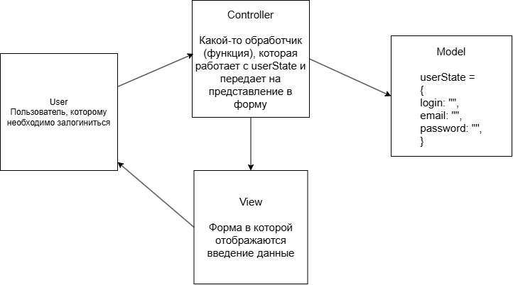

# MVC

## Паттерн MVC - это скорее не паттерн, а архитектурный стиль. 
* M - model, это некая сущность которая отвечаю за данные, бизнес логику
* V - View, это представление, т.е. некоторый видимый результат, который получает данные из Model через Controller.
* C - Controller, можно сказать что это мозг, который отвечает за распределение процесса между представление и моделью.
* ***Т.е. Model ничего не знает про V и C, также как и View ничего не знает про M***

## Пример на фронте
Как по мне все современные фреймворки используют данный архитектурный стиль, например логика логина пользователя.

# Observer

## Паттерн Observer - это паттерн который позволяет объектам оповещать другие объекты об изменениях своего состояния.

## Observer включает в себя:

* Изделатель - это основной класс, который служит неким слушателем, т.е. если было выполнено какое-то соыбытие, он уведомит всех своих подписичков, которые были подписаны на данное событие. 
  - Обычно в нем содержится 4 метода:
    - Метод для подписки
    - Метод для отписки
    - Метод для уведомления
    - Метод который выполняет какую-то общую бизнес логику для всех компонентов, перед уведомлением.
  - И 2 поля:
    - Список подписчиков привязанных к конкретном событию (eventType)
    - Состояние издателя
* Наблюдатели - это классы, которые подписываются на событие и выполняют свою внутренную логику.
  - Метод для выполнения конкретной зоны отвественности наблюдателя.

***Важно, чтобы наблюдатели имплеминитировали один и тот же интерфейс, для того чтобы в классе издателе, можно было вызывать его не привязываясь к конкретному классу (структурная типизация)***

## Рассмотрим на примере проекта "Корпоративная база знаний":

Есть категории, которые интересны определенным пользователям, например "Пути развития в компании". Определенные пользователи хотят видеть уведомление, и также, например, увелечение счетчика уведомлений у себя (это и будет общая бизнес логика у издателя для всех пользотвалей, кто подписался на данное события), когда в данную категорию попадает новая статья.
После добавления статьи, пользователи оценивают её (у каждого пользователя единый интерфейс, т.е. все должны как-минимум иметь метод оценки статьи)

Т.е. в данном случае ***издаталем является категория***, а ***наблюдатели эта все пользователи***, которые ***подписаны на событие добавление новой статить в категорию***.

